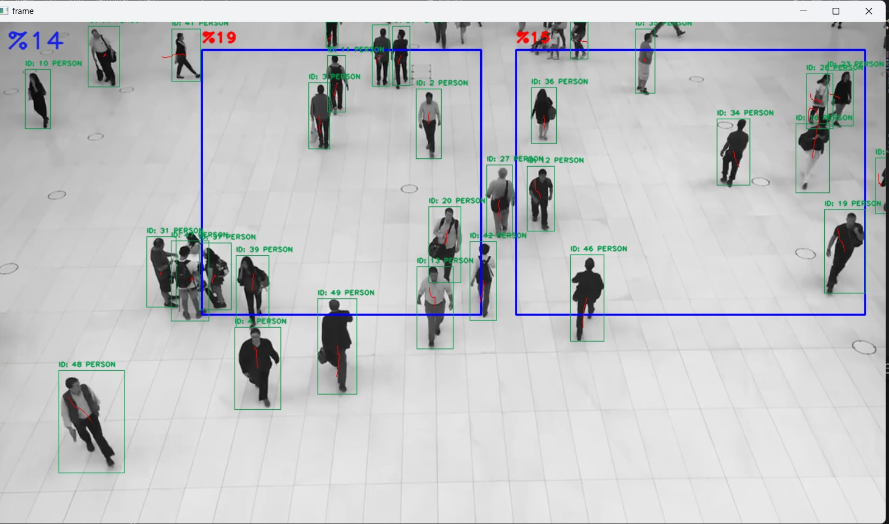

# YOLOV8 ile ROI(Region of Interest->İlgi Alanı) Bölgesinde Yoğunluk Analizi ve Kişi Sayımı
YOLO(You Only Look Once), nesne algılama için kullanılan bir derin öğrenme algoritmasıdır. Güvenlik, plaka tespiti, insan sayımı, ortamı analiz etme gibi birçok alanda kullanılır. Bugün biz YOLOV8 kullanarak hem tüm görüntüden hem de bazı ROI bölgelerinde yoğunluk analizi ve kişi sayımı gerçekleştireceğiz.




```shell

echo Merhaba

```

