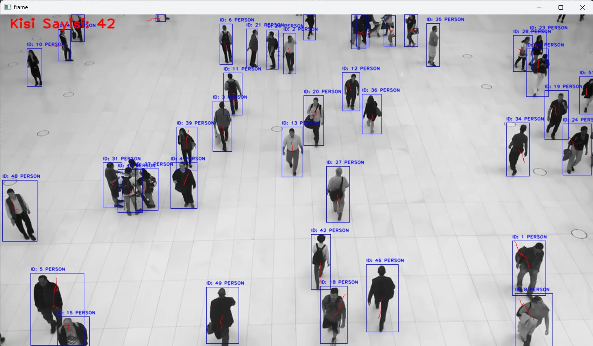
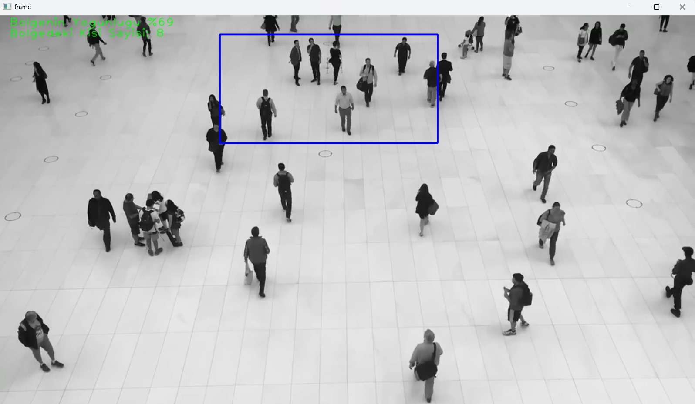

# YOLOV8 ile ROI(Region of Interest->İlgi Alanı) Bölgesinde Yoğunluk Analizi ve Kişi Sayımı
YOLO(You Only Look Once), nesne algılama için kullanılan bir derin öğrenme algoritmasıdır. Güvenlik, plaka tespiti, insan sayımı, ortamı analiz etme gibi birçok alanda kullanılır. Bugün biz YOLOV8 kullanarak hem tüm görüntüden hem de bazı ROI bölgelerinde yoğunluk analizi ve kişi sayımı gerçekleştireceğiz. Bu analizlerde YOLOV8 modelimizi hem onnx formatta hem de .pt uzantılı şekilde gerçekleştirip aradaki farkı göreceğiz.

# Onnx Nedir?
Onnx, modelimizin daha yüksek FPS verip daha yüksek doğrulukla nesneleri tespit etmesini sağlayan bir model formatıdır. Peki bu işlemi nasıl yapıyor?

Eğer daha önce Pytorch, tensorflow-keras gibi kütüphanelerle kendi yapay sinir ağınızı oluşturmuşsanız ya da en azından bu konuda bilgiye sahipseniz bu konuyu daha iyi anlayacağınızı düşünüyoruz.

Hassas Kalibrasyon: TensorRT, hassas kalibrasyonu destekleyerek modellerin belirli doğruluk gereksinimleri için ince ayarlanmasına olanak tanır. Bu, kabul edilebilir doğruluk seviyelerini korurken çıkarım hızını daha da artırabilen INT8 ve FP16 gibi azaltılmış hassasiyet formatları için destek içerir.

Katman Füzyonu: TensorRT optimizasyon süreci, bir sinir ağının birden fazla katmanının tek bir işlemde birleştirildiği katman füzyonunu içerir. Bu, bellek erişimini ve hesaplamayı en aza indirerek hesaplama yükünü azaltır ve çıkarım hızını artırır.


Dinamik Tensör Bellek Yönetimi: TensorRT, çıkarım sırasında tensör bellek kullanımını verimli bir şekilde yöneterek bellek ek yükünü azaltır ve bellek tahsisini optimize eder. Bu da GPU belleğinin daha verimli kullanılmasını sağlar.

Otomatik Çekirdek Ayarı: TensorRT, modelin her katmanı için en optimize GPU çekirdeğini seçmek üzere otomatik çekirdek ayarı uygular. Bu uyarlanabilir yaklaşım, modelin GPU'nun hesaplama gücünden tam olarak yararlanmasını sağlar.


Bu uygulamayı ister tüm alanda bir yoğunluk tespiti için ister spesifik bir alana özgü yapmak isteyin. 

Eğer tüm görüntü üzerinde bir yoğunluk analizi yapmak istiyorsanız aşağıdaki kod bloğunu herhangi bir python idesinde terminale yapıştırabilirsiniz.

```shell

git clone https://github.com/yunusemre2334/yolov8

```

Bunu çalıştırdıktan sonra gelin kodumuzu çalıştıralım


```shell

python yolov8_yogunluk_analizi.py -m best.pt -s e.mp4

```


Görüntümüz üzerindeki insan sayısını hesaplamak için aşağıdaki yazılımı çalıştıralım

```shell

python yolov8_kisi_sayisi.py -m best.pt -s e.mp4

```



Şimdi de gelin yazılımımızı ilgi alanları üzerinde deneyelim


```shell

python yolov8_yogunluk_analizi_ilgi_alanı.py -m best.pt -s e.mp4

```


İlgi alanlarının koordinatlarını da çalışmanıza göre sizin vermeniz için aşağıdaki bloğu çalıştırabilirsiniz.


```shell

python yolov8_yogunluk_analizi_ilgi_alanı.py -m best.pt -s e.mp4 -r1 750 40 1250 420 -r2 300 40 700 420

```


Daha da ileri gidip mouse ile tıkladığımız noktada verdiğimiz en ve boy oranına göre otomatik dikdörtgen çizelim. Ardından çizilen dikdörtgen içinde hem kişi sayısı hem de yoğunluk analizi yapalım.

```shell

python mouse_roi_yogunluk_analizi.py -m best.pt -s e.mp4 -r1 750 40 1250 420 -r2 300 40 700 420

```



Bu gibi çalışmalar için beğenip takip edebilirsiniz.

